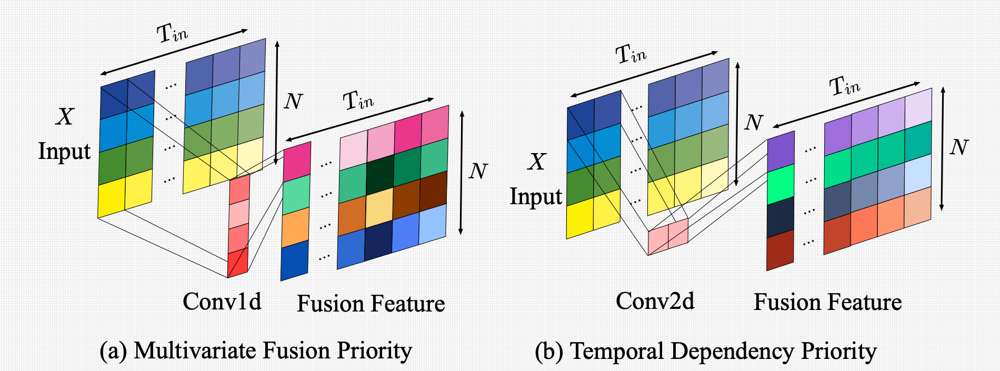
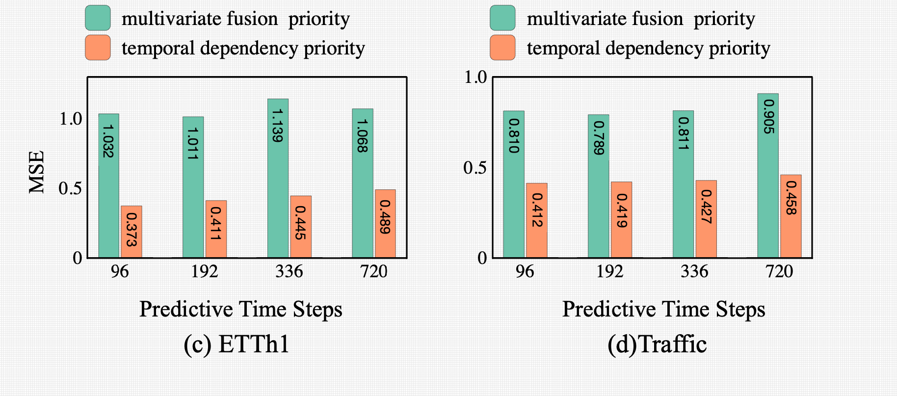
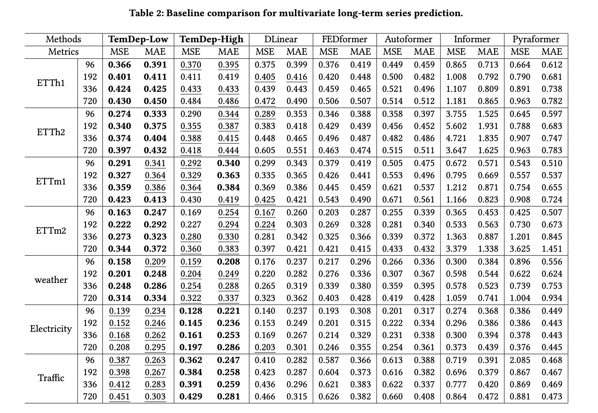

# TemDep(CIKM 2023,UK)

## This is an offical implementation of TemDep:**Temporal Dependency Priority for Multivariate Time Series Prediction.**

## Core Idea

:star: TemDep:The multivariate fusion transformation is ubiquitous in multivariate time series prediction (MTSP) problems. The previous multivariate fusion transformation fuses the feature of different variates at a time step, then projects them to a new feature space for effective feature representation. However, temporal dependency is the most fundamental property of time series. The previous manner fails to capture the temporal dependency of the feature, which is destroyed in the transformed feature matrix. Multivariate feature extraction based on the feature matrix with missing temporal dependency leads to the loss of predictive performance of MTSP. To address this problem, we propose the Temporal Dependency Priority for Multivariate Time Series Prediction (TemDep) method. Specifically, TemDep extracts feature temporal dependency of multivariate time series first and then considers multivariate feature fusion. More- over, the low-dimensional and high-dimensional feature fusion manners are designed with the temporal dependency priority to fit different dimensional multivariate time series. The extensive experimental results of different datasets show that our proposed method can outperform all state-of-the-art baseline methods. It proves the significance of temporal dependency priority for MTSP.
So It can be concluded from the above that the main problems of previous transformer based long-term time series prediction models lie in fusing the feature of different variates at a time step which is Conv1d do.
Then I did some experiments to prove this point.

